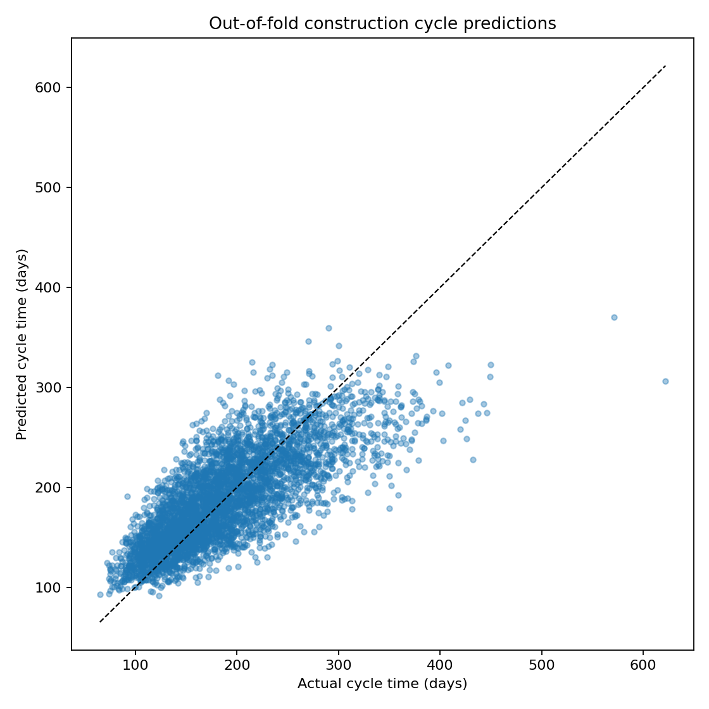
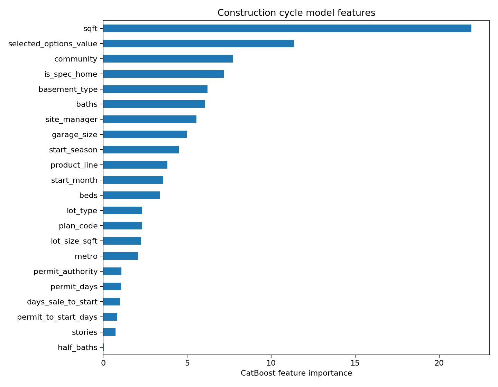

# Construction Cycle Time Prediction

Predict how many days a home will take to build using property specifications,
location, permitting history, and information available when construction begins.
This project turns raw construction records into validated CatBoost predictions
through a reproducible Python pipeline.

The target is **construction end date minus construction start date**, in calendar
days. Predictions support scheduling and completion-date planning; they are point
estimates, not guaranteed completion dates.

## Public data preparation

The included data uses pseudonymous labels: `manager_01` through `manager_18`
and `home_000001` through `home_005237`. Labels were assigned through random
one-to-one mappings shared across both datasets. All reports and charts were
regenerated from these public inputs. Original lot numbers were removed because
they can identify properties and are not used by the model. No original-to-public
identifier mapping is included in this repository or its release ZIP.

These changes replace identifying labels; they do not establish that the source
data is synthetic or fully anonymous. Community, metro, permit authority, dates,
property specifications, and financial values remain and could allow linkage to
other records. See [data preparation and privacy](docs/data_privacy.md).

## Results

The included dataset contains **4,684 historical records** and **578 homes to
predict**. After removing exact duplicates and filtering to eligible completed
builds, **4,077 homes** are available for training and validation.

| Cross-validation metric | CatBoost | Median baseline |
| --- | ---: | ---: |
| MAE (days, lower is better) | 30.9 | 48.9 |
| RMSE (days, lower is better) | 40.4 | 63.4 |
| R² (higher is better) | 0.582 | — |

CatBoost reduces mean absolute error by **36.7%** relative to the median
baseline. Mean training R² is **0.657**. These results were reproduced
with the included Python pipeline and datasets; [per-fold metrics](reports/fold_metrics.csv)
and [predictions](reports/predictions.csv) are included.



Square footage, selected options value, and community are the three most important
features in the fitted model. These are predictive associations, not causal effects.



Validation uses five shuffled folds stratified by floor plan. This measures
performance on a similar mix of homes, rather than forecasting accuracy on a
strictly future time period. See [methodology and limitations](docs/methodology.md).

## Quick start

Tested with **Python 3.13.7**. From the repository root:

```bash
python3 -m venv .venv
source .venv/bin/activate
python -m pip install -r requirements.txt
python pipeline.py
```

On Windows, activate with `.venv\Scripts\activate` instead. No notebook, Jupyter
server, or Colab environment is required.

To also generate the descriptive site-manager analysis:

```bash
python pipeline.py --manager-analysis
```

Paths and model run settings are configurable:

```bash
python pipeline.py \
  --history data/build_history.csv \
  --predict data/homes_to_predict.csv \
  --output-dir outputs \
  --folds 5 \
  --iterations 600
```

Each run writes to the chosen output directory, replacing existing artifacts with
the same names. Use a different directory to retain multiple runs. Manager
artifacts are only refreshed when `--manager-analysis` is enabled.

## Project structure

```text
construction_cycle/
  data.py                 Shared cleaning, schema checks, and feature engineering
  modeling.py             CatBoost training, validation, and manager residuals
data/
  build_history.csv       Historical construction records
  homes_to_predict.csv    Homes requiring predictions
  README.md               Data dictionary and input contract
docs/
  methodology.md          Modeling decisions, interpretation, and limitations
reports/                  Verified results and figures for this dataset
tests/
  test_pipeline.py        Preprocessing and integration tests
pipeline.py               Command-line entry point
requirements.txt          Pinned direct dependencies
requirements-lock.txt     Complete tested environment
```

## Workflow

1. Validate the input schema and home identifiers; remove exact historical duplicates.
2. Standardize categorical values, preserve the `None` basement category, and correct
   the dataset's documented extra-zero square-footage errors.
3. Retain completed builds with cycle times greater than one day and construct 22
   features, excluding completion information and other post-start outcomes.
4. Evaluate CatBoost against a training-fold median baseline on the same five folds.
5. Refit on all eligible historical homes and predict the input homes.
6. Save predictions, the trained model, evaluation metrics, and diagnostic plots.

The model retains the established configuration: **600 iterations**, **depth 5**,
**learning rate 0.03**, and **random seed 42**. CatBoost handles categorical
features directly and accommodates missing numerical values.

## Generated artifacts

By default, artifacts go to the Git-ignored `outputs/` directory:

| Artifact | Contents |
| --- | --- |
| `predictions.csv` | Input home IDs and positive, rounded cycle-day estimates |
| `model.cbm` | CatBoost model fitted on all eligible completed builds |
| `metrics.json`, `fold_metrics.csv` | Mean and per-fold validation metrics, including a median baseline |
| `out_of_fold_predictions.csv` | Predictions made without training on the corresponding home |
| `feature_importance.csv`, `feature_importance.png` | Final model feature importance |
| `predicted_vs_actual.png` | Out-of-fold prediction diagnostic |
| `run_config.json` | Input paths, row counts, features, and model settings |
| `manager_analysis.csv`, `manager_analysis.png` | Optional manager residual summaries and descriptive intervals |

Prediction rows preserve the input order. Every input home must have a unique,
non-missing ID. The row count is determined from the input, not hard-coded to this
dataset. Validation metrics use raw estimates; exported predictions are rounded
to whole days and clipped to a minimum of one day.

## Tests and reproducibility

```bash
python -m unittest discover -s tests -v
```

Tests cover preprocessing parity, literal versus missing basement categories,
invalid targets, duplicate IDs, fold coverage, prediction order, output artifacts,
and saved-model prediction parity. Integration tests use a small synthetic dataset
and a reduced iteration count for speed.

Release checks also verify pseudonymous label formats, removal of lot numbers,
and consistent home and manager references across the public datasets and reports.

For the full tested dependency set, install `requirements-lock.txt` instead of
`requirements.txt`. Results may vary slightly across platforms and dependency
versions. The saved model expects the engineered columns from
`construction_cycle.data.prepare_data`, not raw CSV columns.

## Limitations

- Random cross-validation does not measure performance on future starts or unseen communities.
- Training on completed builds excludes unfinished, potentially slower projects.
- Weather, supply disruptions, labor availability, and later changes are not modeled.
- Options value and manager assignment must reflect information known at construction start.
- Feature importance and adjusted manager residuals describe associations, not causal effects.
- The square-footage correction is specific to this dataset and needs reassessment for new sources.

See [the methodology](docs/methodology.md) for cleaning assumptions and next steps.
